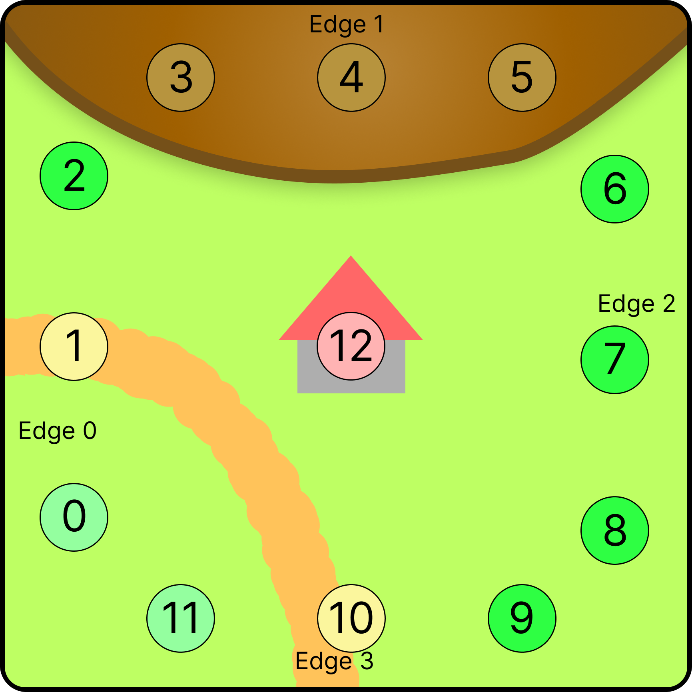

## Carcassonne Env

Carcassonne is  Tile based game that someone can play with up to 5 players. This project implements this game and supports $[2,4]$ players. The rules of the game were implemented according to the provided rule set `./CarcassonneRules.pdf`. The environment was implemented so that it is compatible with the existing Strategy Game Engine (https://gitlab.com/StrategyGameEngine/strategy-game-engine) 

Main focus of the implementation was to produce a well optimized and fast experience where the environment step and the deepCopy of states is very fast and optimized for Monte-Carlo Tree Search. Another big consideration factor was to allow good readability .

#### Interface when implementing Agents for the Environment

The game itself can be used through the normal sge env interface. CaracssonneGame implements that interface. There are two types of actions
a Place Action representing the act of a player ( placing a tile with a meeple)
and a draw action(Draw a Tile and determine the next placeable tile). The draw Actions are usually performed by the SGE-Engine.

the getBoard method of the CaracssonneGame returns the state of the game.The State completely characterizes the current game. The state provides methods for obtaining information about the current state.

When doing MCTS the state provides all methods needed to calculate the simulations or do deep copies fast.

#### General Concepts

##### Area and tiles
A Tile has a position, rotation and the areas. A Area is defined as a place where a Meeple can be placed. Each tile has 13 areas (3 areas per edge and one for a possible Monastery). The areas can be connected to each other this implemented using a Union-Find Data Structure. The representative of each area(Representative in the Union Find) holds information for quick and fast execution. The AreaRegistry manages all things regarding the management of the areas. Each area has a localId which indicates where it is if the tile is not rotated.

  

##### Bit Packing

Internally the areas, tiles and other concepts are captured with bitpacking. In java a methods can only return one value. The normal approach for returning mutliple values in java is to use a class which holds the information. Classes live on the heap and interacting with the heap is slow. In order to speed up the simulation speed bit packing was used. When returning values it rarely happens that the complete range of values of the datatype is used. Bitpacking uses that to store multiple smaller values in one primitive data type. This can be achieved using bit operations. In order to reduce the error-proneness and improve readability a java processor was implemented that generates the source for the bitpacking based on annotated classes. This means that for intelliSense to work the project needs to be build first and then the maven project reloaded every time the bitpacking annotations are changed

##### Rest

The rest of the documentation is in the java doc in the code or the github pages site
